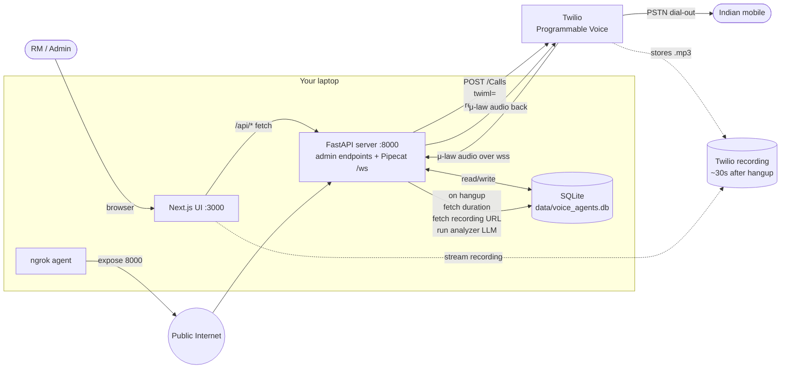
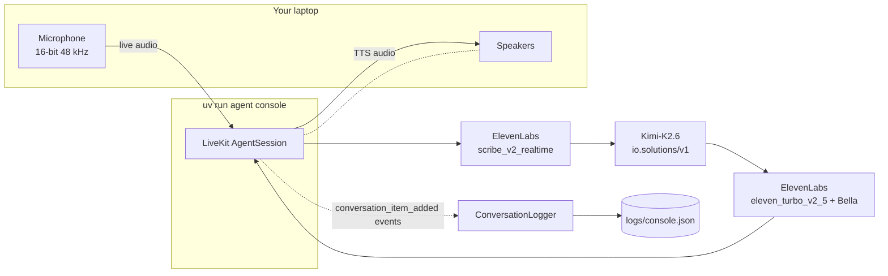
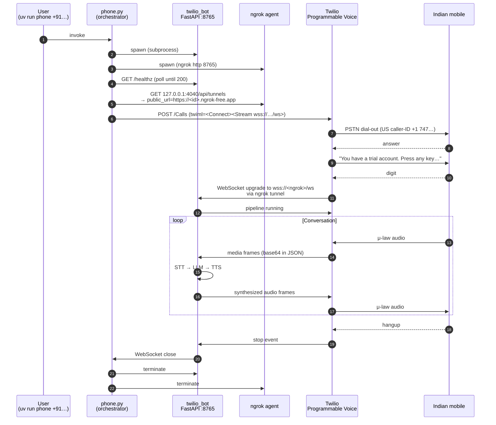
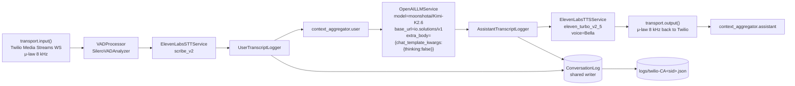
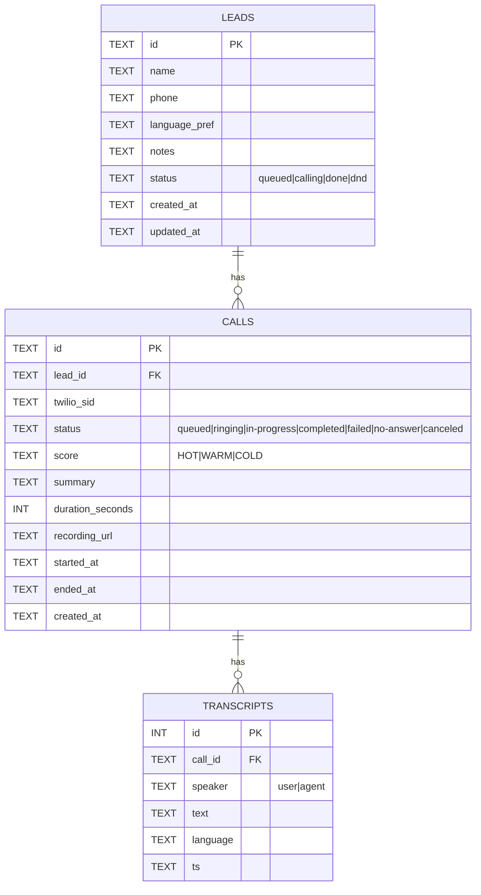

# Rupeezy AP Voice Agent — Technical Reference

How the current integration is wired end to end. Three surfaces share the
same intelligence layer (system prompt, models, conversation pipeline):

- **Console mode** — laptop microphone and speaker. Single process. Run with
  `uv run agent console`.
- **Phone mode (one-shot)** — orchestrator script that dials a single number.
  Run with `uv run phone +91XXXXXXXXXX`.
- **Admin platform** — full FastAPI backend + Next.js UI. Lead upload,
  batch dialing, conversation review, recordings, Hot/Warm/Cold scoring,
  funnel dashboard. Run with `uv run api` + `cd ui && npm run dev` + `ngrok http 8000`.

All modes write to the same SQLite database (`data/voice_agents.db`) and the
same per-call JSON files (`logs/<room>.json`). The database is the source of
truth for the admin UI; the JSON files are kept for casual inspection.

## 0. End-to-end with the admin platform



---

## 1. Stack at a glance

| Layer | Choice | Why |
|---|---|---|
| Voice agent framework (console) | **LiveKit Agents 1.5** | Mature `AgentSession` STT→LLM→TTS pipeline; `agents console` mode gives a free local mic+speaker harness. |
| Voice agent framework (phone) | **Pipecat 1.1** | Built by Daily, has first-class Twilio Media Streams transport. Same conceptual pipeline as LiveKit; lets us avoid a SIP trunk. |
| Telephony (phone) | **Twilio Programmable Voice — Media Streams** | Free trial credit dials Indian mobiles after SMS-verifying the destination. India geo-permission is self-serve. No SIP trunk needed. |
| Public-tunnel for the bot WebSocket | **ngrok** (free tier) | Twilio's `<Connect><Stream>` needs a `wss://` URL reachable from the internet; ngrok gives that without deploying anything. |
| STT | **ElevenLabs Scribe** — `scribe_v2_realtime` (LiveKit path), `scribe_v2` (Pipecat path) | Multilingual. Hindi/Tamil/English/Hinglish all auto-detect. Sub-second latency on realtime. |
| LLM | **Moonshot Kimi-K2.6** via vLLM at `io.solutions/v1` | Multilingual native (replies in whatever language the user spoke). Free credits. Reasoning disabled (`chat_template_kwargs.thinking=false`) so we don't pay 1–4s of latency before each spoken word. |
| TTS | **ElevenLabs `eleven_turbo_v2_5`** + voice **Bella** (`hpp4J3VqNfWAUOO0d1Us`) | Multilingual model — same voice speaks Hindi, Tamil, English. ~300ms first-byte. |
| VAD (phone) | **Silero VAD** (ONNX runtime) | Detects user speech to enable interruption / barge-in. |
| Project mgmt | **uv** | First-class per `plan.md`. `uv add`, `uv sync`, `uv run`. |
| Transcript persistence | Per-call JSON in `logs/` | Same shape across both modes so the post-call summary stage is transport-agnostic. |

---

## 2. End-to-end conversation pipeline (logical view)

This is the same 5-stage pipeline regardless of run mode:

```mermaid
flowchart LR
    User([User audio<br/>mic or phone]) -->|raw audio| VAD[Silero VAD<br/>speech detection]
    VAD -->|speech segments| STT[ElevenLabs STT<br/>scribe_v2 / scribe_v2_realtime]
    STT -->|TranscriptionFrame<br/>auto-detected language| Ctx[Context aggregator<br/>system prompt + history]
    Ctx -->|chat messages| LLM[Kimi-K2.6<br/>thinking off via extra_body]
    LLM -->|LLMTextFrame chunks| TTS[ElevenLabs TTS<br/>eleven_turbo_v2_5 + Bella]
    TTS -->|audio chunks| Out([User hears reply<br/>speaker or phone])

    STT -.->|finalized turn| Logger[(JSON Logger<br/>turns[].speaker=user)]
    LLM -.->|aggregated reply| Logger
    Logger -.->|per call| File[logs/&lt;room&gt;.json]
```

**Key design choices.**
- *Native multilingual at every stage* — no translation hop. STT outputs Tamil/Hindi/English text directly; Kimi reads and writes in the same language; TTS speaks it.
- *Reasoning off* on the LLM (`extra_body={"chat_template_kwargs": {"thinking": false}}`). Kimi-K2.6 is a thinking model by default — leaving it on adds 1–4 s of "reasoning" tokens before the first audible word, which kills phone-call feel.
- *VAD between transport and STT* — pipecat 1.1 wires VAD as a `VADProcessor` in the pipeline (the legacy `vad_analyzer=` kwarg on transport params is silently ignored).
- *Two logger taps* — user transcripts are consumed by the context aggregator before the LLM, and assistant text is generated downstream. We tap once before the user aggregator and once after the LLM, sharing one `ConversationLog` writer.

---

## 3. Console mode (LiveKit Agents)



**Files involved.**
- `src/voice_agents/agent.py` — `RupeezyAgent(Agent)` + `entrypoint(ctx)`. Builds `AgentSession(stt=…, llm=…, tts=…)`. Run via `cli.run_app(WorkerOptions(entrypoint_fnc=entrypoint))`.
- `src/voice_agents/conversation_logger.py` — subscribes to `AgentSession` events `user_input_transcribed` and `conversation_item_added`, writes per-turn records.
- `src/voice_agents/prompts.py` — `SYSTEM_PROMPT` and `GREETING_INSTRUCTION`.

**Run.**
```bash
uv run agent console
```
- Talks via your laptop mic and speakers.
- No greeting on console (we only auto-greet on outbound phone). You speak first.
- Hang up with Ctrl-C; transcript lands in `logs/console.json`.

---

## 4. Phone mode (Pipecat + Twilio Media Streams + ngrok)

This is the path that actually rings your Indian mobile. Triggered by a single
command which spawns the bot, opens a tunnel, places the call, and tears
everything down on hangup.



### Internal pipeline (inside the bot)



**Key implementation notes.**
- Twilio Media Streams use **μ-law 8 kHz** in both directions. `FastAPIWebsocketParams(audio_in_sample_rate=8000, audio_out_sample_rate=8000)` plus `TwilioFrameSerializer` does the codec dance.
- Twilio sends a **`connected`** then **`start`** event over the WebSocket before any audio. The bot reads both up-front to capture `streamSid` / `callSid`, which the serializer needs to construct.
- The greeting kicks in via an `on_client_connected` handler that queues `LLMRunFrame()` so the LLM speaks first against the system-prompted context (Hinglish opener as Priya).
- On hangup we receive an `on_client_disconnected` callback → `EndFrame()` → clean pipeline shutdown.
- `convo_log.close()` in the `finally` block flushes any in-flight assistant chunks even if the LLM end frame didn't fire.

### Files involved

| File | Role |
|---|---|
| `src/voice_agents/phone.py` | One-command orchestrator — spawns bot + ngrok, places call, waits, cleans up. CLI: `uv run phone +91…`. |
| `src/voice_agents/twilio_bot.py` | FastAPI app with `POST /twiml` (returns `<Connect><Stream>`) and `WS /ws` (the actual pipeline). |
| `src/voice_agents/pipecat_logger.py` | `ConversationLog` writer + `UserTranscriptLogger` and `AssistantTranscriptLogger` processor shims. |
| `src/voice_agents/twilio_dial.py` | Standalone dial CLI for advanced use (assumes bot+ngrok already running separately). |
| `scripts/test_twilio_call.py` | Pre-flight: places a `<Say>`-only call to confirm Twilio account, geo-permission, and verified caller-ID are all healthy. No bot involved. |

### Run

```bash
uv run phone +91XXXXXXXXXX
# When the phone rings: press any digit to skip Twilio's trial gate, then speak.
# Hang up to end. Transcript lands in logs/twilio-CA<sid>.json.
```

---

## 5. Conversation log format

Both modes produce the same shape so the qualification / summary stage is
transport-agnostic:

```json
{
  "room": "twilio-CAxxxxxxxx",
  "phone_number": "+91XXXXXXXXXX",
  "started_at": "2026-05-07T01:23:45+00:00",
  "ended_at":   "2026-05-07T01:26:12+00:00",
  "transport":  "pipecat",
  "turns": [
    {"ts": "...Z", "speaker": "agent", "text": "Namaste! Main Priya bol rahi hoon...", "language": null},
    {"ts": "...Z", "speaker": "user",  "text": "Haan boliye",                          "language": "hi"},
    {"ts": "...Z", "speaker": "agent", "text": "Aap mutual fund distributor hain?",   "language": null},
    {"ts": "...Z", "speaker": "user",  "text": "Yes",                                  "language": "en"}
  ]
}
```

`language` on user turns is the per-turn auto-detected code from STT (`hi`,
`en`, `ta`, …). `language: null` on agent turns because TTS doesn't expose a
detected language — Kimi just writes whatever the user wrote.

---

## 6. Configuration (`.env`)

| Var | Used by | Purpose |
|---|---|---|
| `OPENAI_API_KEY`, `OPENAI_BASE_URL`, `OPENAI_LLM_MODEL` | Both modes | Kimi-K2.6 via io.solutions vLLM endpoint. |
| `LLM_DISABLE_THINKING=1` | Both modes | Set to `0` to keep chain-of-thought (slower; better for hard reasoning later). |
| `ELEVENLABS_API_KEY` (also accepted as `ELEVEN_API_KEY`) | Both modes | STT + TTS auth. |
| `ELEVENLABS_VOICE_ID` | Both modes | Default `hpp4J3VqNfWAUOO0d1Us` (Bella). |
| `ELEVENLABS_TTS_MODEL` | Both modes | Default `eleven_turbo_v2_5` (multilingual + low latency). |
| `ELEVENLABS_STT_MODEL` (LiveKit) / `ELEVENLABS_STT_MODEL_PIPECAT` (Pipecat) | Console / Phone | LiveKit uses realtime websocket model `scribe_v2_realtime`; Pipecat hits the synchronous endpoint which only accepts `scribe_v2`. |
| `TWILIO_ACCOUNT_SID`, `TWILIO_AUTH_TOKEN`, `TWILIO_FROM_NUMBER` | Phone | Twilio API + caller-ID. |
| `TEST_TO_NUMBER` | `scripts/test_twilio_call.py` | Default destination for the pre-flight script. |
| `TWILIO_BOT_PORT` | Phone | Local FastAPI port (default 8765). |
| `CONVERSATION_LOG_DIR` | Both modes | Default `logs`. |
| `LIVEKIT_URL`, `LIVEKIT_API_KEY`, `LIVEKIT_API_SECRET` | LiveKit-only paths | Only needed if you ever switch the phone path back to LiveKit + SIP. Not used by `phone` / `twilio-bot`. |
| `DAILY_API_KEY` | Daily-only paths | Daily blocks international dial-out; this remains for the abandoned Pipecat-Daily code path. Not used by `phone`. |

---

## 7. Why we ended up here (decision log)

| Tried | Outcome |
|---|---|
| LiveKit + Plivo SIP trunk | Plivo requires Indian credit card + business KYC for India outbound. Skipped. |
| Daily PSTN dial-out via Pipecat | Daily account returns *"International dialout not supported. Contact sales to enable it for your domain"* — manual approval gate. Skipped. |
| LiveKit + Twilio SIP trunk | Works, but requires LiveKit Cloud signup. We have a working code path (`agent.py` + `dispatch_call.py`) if you ever want it. |
| Twilio + Pipecat Media Streams + ngrok | **What we're using.** No new accounts, one command, India self-serve. |

---

## 8. Trial-account caveat

Twilio trial accounts:
1. Require the destination number on the **Verified Caller IDs** list (`+91 9444531354` is verified).
2. Play *"You have a trial account, press any key to execute your code"* before every outbound call. **Press any digit** when the call rings to skip it. If you don't press, the call hangs up before our `<Connect><Stream>` runs.
3. Indian carriers may flag the call as **"Spam"** or **"International"** caller-ID. The call still goes through.

Topping up Twilio with $20 promotes the account to pay-as-you-go, which removes the trial gate and the "Spam" tag.

---

## 9. What's NOT done yet (next phase)

This MVP stops at "phone rings, full Hinglish/Hindi/Tamil conversation happens, JSON log written." The remaining hackathon Theme-7 surface area:

- **Lead qualification scoring** — Hot / Warm / Cold based on conversation signals (interest verbs, objection patterns, specific asks).
- **Post-call summary** — LLM pass over the JSON transcript producing duration, topics, objections, score, recommended next step.
- **RM handoff** — Hot leads packaged with full transcript + summary into something an RM dashboard can consume.
- **WhatsApp follow-up** — auto-send sign-up link to Warm leads.
- **Sarvam STT/TTS swap-in** — for Telugu / Marathi / Gujarati / Bengali, where Sarvam is stronger than ElevenLabs.
- **Funnel dashboard** — contacted → qualified → handed-off, with per-call drill-down.

All of these consume the same `logs/<room>.json` shape, so they're a clean layer on top of the current code.

---

## 10. File map (current repo)

```
voice-agents/
├── pyproject.toml                       # uv-managed; entry points below
├── .env / .env.example                  # all credentials and toggles
├── plan.md / hack-questions.md          # original brief + Theme 7 spec
├── tech.md                              # this document
├── README.md                            # user-facing how-to
├── data/                                # SQLite DB lives here (gitignored)
│   └── voice_agents.db
├── src/voice_agents/
│   ├── prompts.py                       # build_system_prompt() — configurable persona
│   ├── db.py                            # SQLite schema + helpers (leads/calls/transcripts)
│   ├── analyzer.py                      # post-call Kimi pass: Hot/Warm/Cold + summary
│   ├── conversation_logger.py           # LiveKit/AgentSession event-based logger
│   ├── pipecat_logger.py                # ConversationLog → JSON + SQLite (dual write)
│   ├── agent.py                         # LiveKit Agents — console mode
│   ├── twilio_bot.py                    # standalone Pipecat bot (legacy; superseded by api/)
│   ├── twilio_dial.py                   # standalone Twilio dial CLI (legacy)
│   ├── phone.py                         # one-command orchestrator (single dial, no DB)
│   ├── pipecat_bot.py                   # Pipecat-Daily bot (abandoned: Daily blocks INT)
│   ├── dial_daily.py                    # Pipecat-Daily dialer (abandoned)
│   └── dispatch_call.py                 # LiveKit SIP-trunk dialer (legacy / unused)
├── api/
│   ├── __init__.py
│   └── server.py                        # ★ Unified FastAPI: /api/* + Pipecat /ws + /twiml
├── ui/
│   ├── package.json                     # Next.js 15 + Tailwind + Radix
│   ├── next.config.mjs                  # /api/* proxy → http://localhost:8000
│   ├── app/
│   │   ├── layout.tsx                   # Top nav: Dashboard / Leads / Calls
│   │   ├── page.tsx                     # / — funnel metrics + recent calls
│   │   ├── leads/page.tsx               # /leads — add, CSV upload, batch call
│   │   ├── calls/page.tsx               # /calls — all calls with score filter
│   │   └── calls/[id]/page.tsx          # /calls/<id> — transcript, recording, summary
│   ├── components/ui.tsx                # Card, Button, ScoreBadge, StatusPill, Input…
│   └── lib/{api.ts,utils.ts}            # typed API client + formatters
├── scripts/
│   ├── test_twilio_call.py              # Twilio account sanity check (no bot)
│   └── tamil.sh                         # Curl proof Kimi-K2.6 handles Tamil natively
└── logs/                                # per-call JSON transcripts (gitignored)
```

### Entry points

Python (run with `uv run <name>`):

| Command | What it does |
|---|---|
| `uv run agent console` | Local mic/speaker test (LiveKit AgentSession). No DB. |
| `uv run phone +91XXXXXXXXXX` | One-shot dial: bot + ngrok + Twilio call. No DB; useful for debugging. |
| `uv run api` | **★ Primary platform server.** Unified FastAPI on :8000 hosting admin REST + Pipecat /ws bot. Talks to SQLite. |
| `uv run twilio-bot` / `twilio-dial` | Standalone Twilio bot + dial — superseded by `api`, kept for debugging. |

Frontend:

```bash
cd ui && npm install && npm run dev      # http://localhost:3000
```

### Bringing up the full admin platform

```bash
# 1. uv sync (once)
uv sync

# 2. terminal A — backend
uv run api

# 3. terminal B — public tunnel for Twilio's WS to reach :8000
ngrok http 8000

# 4. terminal C — admin UI
cd ui && npm install && npm run dev

# 5. open http://localhost:3000
#    upload a CSV of leads, click Call, watch the funnel update.
```

### REST API reference

| Method | Path | What it does |
|---|---|---|
| GET    | `/api/health` | liveness + which agent persona / LLM is configured |
| GET    | `/api/dashboard` | funnel counts (leads, contacted, completed, hot/warm/cold) |
| GET    | `/api/leads?status=queued` | list leads, optional status filter |
| POST   | `/api/leads` | create one lead `{name, phone, language_pref?, notes?}` |
| POST   | `/api/leads/upload` | bulk CSV upload (multipart `file`) |
| DELETE | `/api/leads/{id}` | delete one lead |
| POST   | `/api/leads/{id}/call` | trigger an outbound call now |
| POST   | `/api/calls/batch?limit=10` | call up to N queued leads |
| GET    | `/api/calls?score=HOT` | list calls, filter by score |
| GET    | `/api/calls/{id}` | call detail with transcript + recording URL + summary |
| POST   | `/api/calls/{id}/analyze` | re-run Hot/Warm/Cold scorer + summary on the transcript |
| GET    | `/twiml` | TwiML returning `<Connect><Stream wss://…/ws>` (used internally) |
| WS     | `/ws` | Twilio Media Streams bridge running the Pipecat pipeline |

### Data model



### Configurable agent persona

`AGENT_NAME`, `AGENT_BRAND`, `AGENT_PRONOUNS` are read from `.env` and
templated into the system prompt at call time, so swapping voices /
personas needs zero code change. `prompts.build_system_prompt(lead_name=…)`
also personalises the opener with the lead's name when one is in the DB.

---

## 11. Latency budget on a phone turn

Approximate end-to-end on the current stack, India ↔ US-east tunnel:

| Stage | Time |
|---|---|
| User stops speaking → VAD endpoint | ~200 ms |
| STT round-trip (`scribe_v2` sync, ~2-second utterance) | 600–900 ms |
| LLM (Kimi-K2.6, thinking off, ~80-token reply) | 700–1200 ms |
| TTS first byte (`eleven_turbo_v2_5`) | ~300 ms |
| Twilio + ngrok + PSTN one-way audio | ~250–400 ms |
| **Total user-perceived turn-around** | **~2.0–3.0 s** |

Reasoning enabled (`LLM_DISABLE_THINKING=0`) adds 1–4 s to the LLM stage. For a phone agent we want this off; for the post-call qualification pass (no real-time pressure) we'll turn it on.
